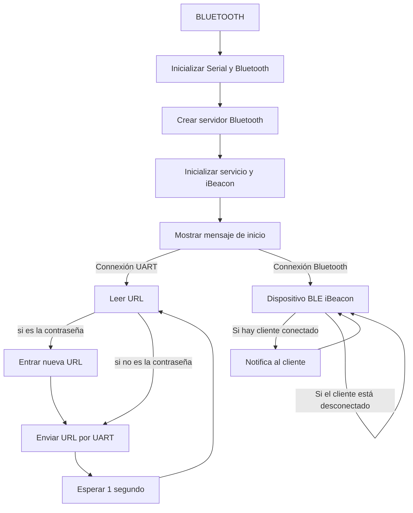
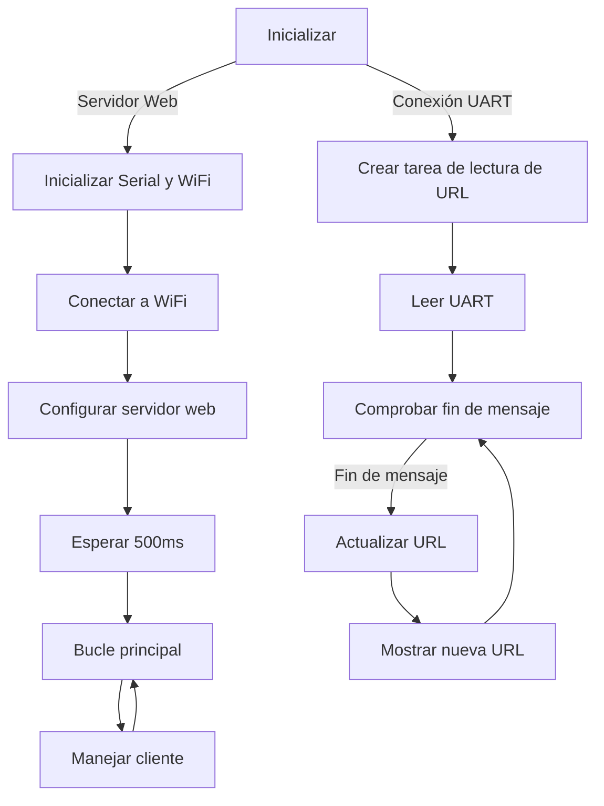

# Procesadores Digitales
## Proyecto Final

## Redireccionamiento iBeacon

### Funcionamiento
<div align="justify">
Este proyecto se basa en un redireccionamiento a través de un servidor web creado localmente por una wifi. Esto se consigue gracias a una comunicación uart entre dos procesadores ESP32: uno envía una cadena de caracteres al segundo y esta cadena es la dirección url que será recibida por el segundo. El primero se encargará de funcionar como un dispositivo BLE iBeacon, un tipo de conexión bluetooth que funciona tan solo cuando el usuario se aproxima al dispositivo, emitiendo señales para que se connecte - esta conexión también permite al usuario enviar y leer datos. Una vez connectado, este se encarga de enviar esta información en forma de notificaciones al cliente y por cable al otro ESP32. Por lo que la tarea del segundo procesador es recoger estos datos que le llegan a través de su serial e iniciar un servidor wifi que, al connectarse a esa misma red con su dirección IP, envíe al usuario la url del primer procesador. 

Además, hay una funcionalidad adicional. Si envías una cadena de caracteres determinada (vamos a llamarla contraseña), el usuario puede cambiar la información que envía al segundo procesador. Es decir, podemos cambiar la dirección url de destino final.

### Bluetooth

El código implementado para el primer microprocesador es el siguiente:
```cpp
#include <Arduino.h>
#include <BLEDevice.h>
#include <BLEServer.h>
#include <BLEUtils.h>
#include <BLE2902.h>
#include <BLEBeacon.h>

#define DEVICE_NAME            "ESP32"
#define SERVICE_UUID           "7A0247E7-8E88-409B-A959-AB5092DDB03E"
#define BEACON_UUID            "2D7A9F0C-E0E8-4CC9-A71B-A21DB2D034A1"
#define BEACON_UUID_REV        "A134D0B2-1DA2-1BA7-C94C-E8E00C9F7A2D"
#define CHARACTERISTIC_UUID    "82258BAA-DF72-47E8-99BC-B73D7ECD08A5"

BLEServer *pServer;
BLECharacteristic *pCharacteristic;
bool deviceConnected = false;
bool mode_set_url = false;

std::string stURL="http://github.com";

class MyServerCallbacks: public BLEServerCallbacks {
    void onConnect(BLEServer* pServer) {
      deviceConnected = true;
      Serial.println("deviceConnected = true");
    };

    void onDisconnect(BLEServer* pServer) {
      deviceConnected = false;
      Serial.println("deviceConnected = false");

      // Restart advertising to be visible and connectable again
      BLEAdvertising* pAdvertising;
      pAdvertising = pServer->getAdvertising();
      pAdvertising->start();
      Serial.println("iBeacon advertising restarted");
    }
};

//************************************************************
class MyCallbacks: public BLECharacteristicCallbacks {
    void onWrite(BLECharacteristic *pCharacteristic) {

      std::string tmp;

      tmp=pCharacteristic->getValue();

      if (mode_set_url) {
        mode_set_url=false;

        stURL=tmp;
        
        Serial.print("Saved URL: ");
        Serial.println(stURL.c_str());

      }
      else {
        if (tmp=="password") {
            mode_set_url=true;

            Serial.println("Waiting URL to save...");
        }
      }

    }

    void onRead(BLECharacteristic *pCharacteristic) {
      
      pCharacteristic->setValue(stURL);
      pCharacteristic->notify();

    }
};
//*******************************************************************

void init_service() {
  BLEAdvertising* pAdvertising;
  pAdvertising = pServer->getAdvertising();
  pAdvertising->stop();

  // Create the BLE Service
  BLEService *pService = pServer->createService(BLEUUID(SERVICE_UUID));

  // Create a BLE Characteristic
  pCharacteristic = pService->createCharacteristic(
                      CHARACTERISTIC_UUID,
                      BLECharacteristic::PROPERTY_READ   |
                      BLECharacteristic::PROPERTY_WRITE  |
                      BLECharacteristic::PROPERTY_NOTIFY
                    );
  pCharacteristic->setCallbacks(new MyCallbacks());
  pCharacteristic->addDescriptor(new BLE2902());

  pAdvertising->addServiceUUID(BLEUUID(SERVICE_UUID));

  // Start the service
  pService->start();

  pAdvertising->start();
}

void init_beacon() {
  BLEAdvertising* pAdvertising;
  pAdvertising = pServer->getAdvertising();
  pAdvertising->stop();
  // iBeacon
  BLEBeacon myBeacon;
  myBeacon.setManufacturerId(0x4c00);
  myBeacon.setMajor(5);
  myBeacon.setMinor(88);
  myBeacon.setSignalPower(0xc5);
  myBeacon.setProximityUUID(BLEUUID(BEACON_UUID_REV));

  BLEAdvertisementData advertisementData;
  advertisementData.setFlags(0x1A);
  advertisementData.setManufacturerData(myBeacon.getData());
  pAdvertising->setAdvertisementData(advertisementData);

  pAdvertising->start();
}

void setup() {
  Serial.begin(115200);
  Serial.println();
  Serial.println("Initializing...");
  Serial.flush();

//serial 2

  Serial2.begin(9600, SERIAL_8N1, 17, 16);

//Bluetooth 

  BLEDevice::init(DEVICE_NAME);
  pServer = BLEDevice::createServer();
  pServer->setCallbacks(new MyServerCallbacks());

  init_service();
  init_beacon();

  Serial.println("iBeacon + service defined and advertising!");

}

void loop() {
  //connexión uart
  Serial2.write(stURL.c_str()); //mensaje
  Serial2.write(0); //fin mensaje
  delay(1000);
}
```
</div>
El diagrama de flujo es el siguiente:


### Servidor Web
El código implementado para la parte del servidor web es el siguiente:
```cpp
#include <Arduino.h>
#include <WiFi.h>
#include <WebServer.h>

// Per defecte
std::string stURL="http://google.es";

const char* ssid = "************";
const char* password = "************";

WebServer server(80);

void handle_root();

void read_url_task(void * parameter);

extern String head;
extern String tail;

void setup() {
  Serial.begin(115200);
  Serial.println();
  Serial.println("Initializing...");
  Serial.flush();

//serial 2

  Serial2.begin(9600, SERIAL_8N1, 17, 16);
  xTaskCreate(
    read_url_task, 
    "read_url_task",
    1000, 
    NULL,
    1, 
    NULL
  );

//Wifi ....

  Serial.println();
  Serial.println();
  Serial.print("Connecting to ");
  Serial.println(ssid);

  WiFi.begin(ssid, password);

  while (WiFi.status() != WL_CONNECTED) {
      delay(500);
      Serial.print(".");
  }

  Serial.println("");
  Serial.println("WiFi connected.");
  Serial.println("IP address: ");
  Serial.println(WiFi.localIP());

  server.on("/", handle_root);
  server.begin();
  delay (500);
}

void read_url_task(void * parameter) {
  char dato;
  std::string stTMP="";
  while (1) {
    while (Serial2.available() > 0){
        dato = Serial2.read();
        if (dato == 0) { //fin mensaje
          if (stTMP!=stURL) {
            Serial.print("New URL: ");
            Serial.println(stTMP.c_str());
            stURL=stTMP;            
          }
          stTMP="";
        }
        else { //mensaje
          stTMP = stTMP + dato;
        }
    }
    delay(500);
  }
}

void handle_root() {
  String html = head + stURL.c_str() + tail;
  server.send(200, "text/html", html);
}

void loop() {
  server.handleClient();
}
```

Añadiendo un `.cpp` con los `string` que forman la página html de espera antes de redireccionarte.
```cpp
#include <Arduino.h>
String head = "<!DOCTYPE html>\n\
<html>\n\
  <head>\n\
    <meta http-equiv=\"refresh\" content=\"2; url='";

String tail = "'\"/>\n\
    <style>\n\
      body {\n\
        background-color: #f5f5f5;\n\
        font-family: 'Montserrat';\n\
        color: #333;\n\
        margin: 0;\n\
        padding: 0;\n\
      }\n\
      .container {\n\
        display: flex;\n\
        justify-content: center;\n\
        align-items: center;\n\
        height: 100vh;\n\
        text-align: center;\n\
      }\n\
      .box {\n\
        background-color: #e0e0e0;\n\
        border: 2px solid #555;\n\
        border-radius: 10px;\n\
        padding: 20px;\n\
        margin: 10px;\n\
      }\n\
      p {\n\
        font-size: 24px;\n\
        color: #555;\n\
        margin-top: 20px;\n\
      }\n\
    </style>\n\
  </head>\n\
  <body>\n\
    <div class=\"container\">\n\
      <div class=\"box\">\n\
        <p>You will be redirected soon! </p>\n\
      </div>\n\
    </div>\n\
  </body>\n\
</html>";
```

Con un diagrama de flujo como el siguiente:
